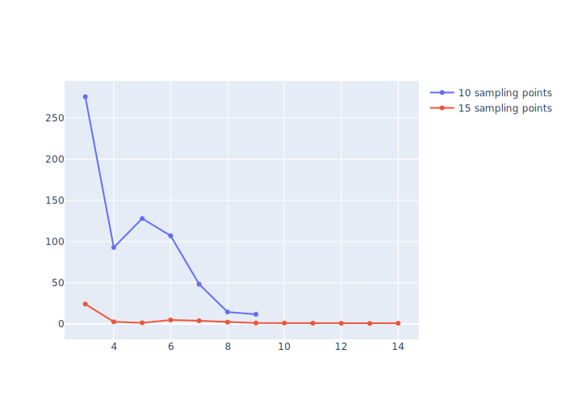
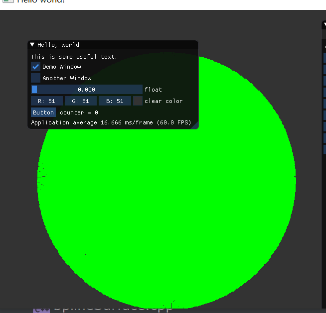
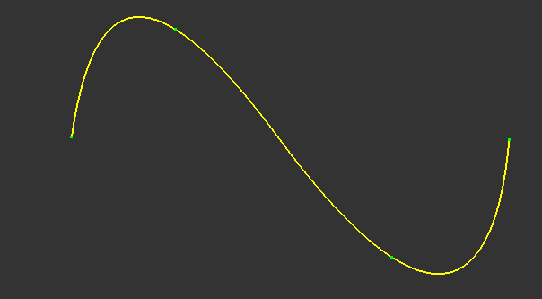
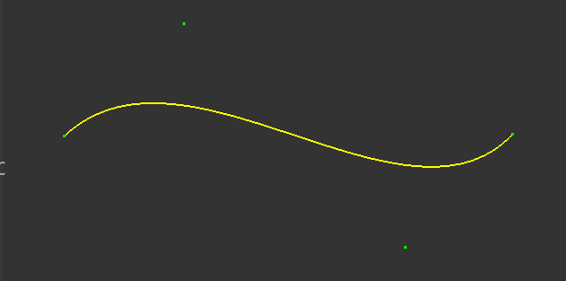
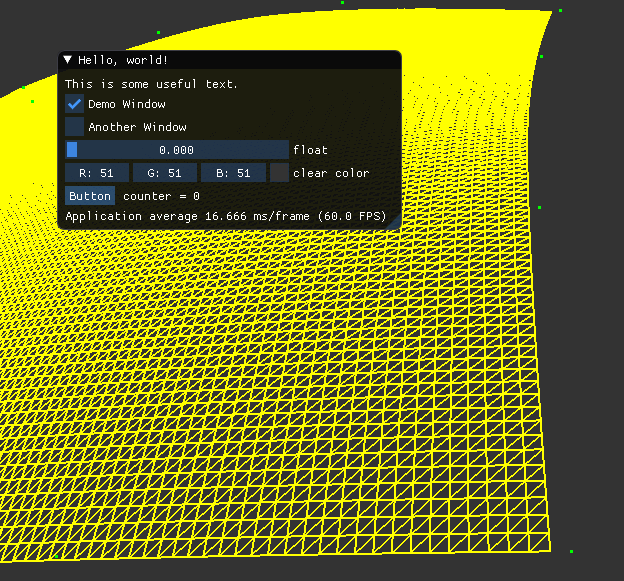

# calculateBezierandBspline 

## Contents 
In this project, I implement a framework about Bezier and Bspline. 
在这个项目中，我对课程中有关Bezier和Bspline的项目集中实现。我选择使用Bspline曲线去拟合一个球，并根据errorDistance去判定拟合标准。 

## Envirments 
AMD 3800 cpu, rtx3090. 

## Results 
> 从球上，按参数方程（对应地球经纬度模型），从原始球模型采样10x10个点或者15x15个点，然后基于这些点进行BSpline曲线拟合，
> 考虑到可以使用不同的degree去拟合，
> 因此我将degree分别设为3-9以及3-14去计算拟合精度。 拟合精度可以通过Bspline插值的点与这些点到球面的最小距离的和计算。 
> 计算统计结果如下所示：

结论:
> - 误差距离在选取的采样点上是最低的（因为必须过这些点），然后在采样点中间某个位置变的最大。 
> - 由于采样点的位置在变化，采样点和最后Bspline的t所决定的采样点的相对位置可能会发生变化，这导致了loss可能会随着degree的增加而暂时增加。但是,整体来说，loss是随着degree的增加而缓慢减少的。 
> - 随着采样点的增多，即使是相同degree的bspline，较多采样点也会大大降低对应loss，这在低degree的时候效果尤为显著。 

## some interestring Result
Bspline Approximation

Bspline Interpolation for 4 data points 
  
Bspline  with 4 control Points 
  
Bezier  with 4 control points
  
Bspline Surface with  16 Control Points 

## some highLight of this code 
> - This is a very comprehensive framework about Bezier and Bspline. 
> - Because this implements the decalsteliau method and bernstein basis method for Bezier Curve and Surface. 
> - In addition, this method also implements the  deboor method and Cox-deboor method for Bspline Curve and Surface.  
> - At last, this code implements the basis view framework. 
